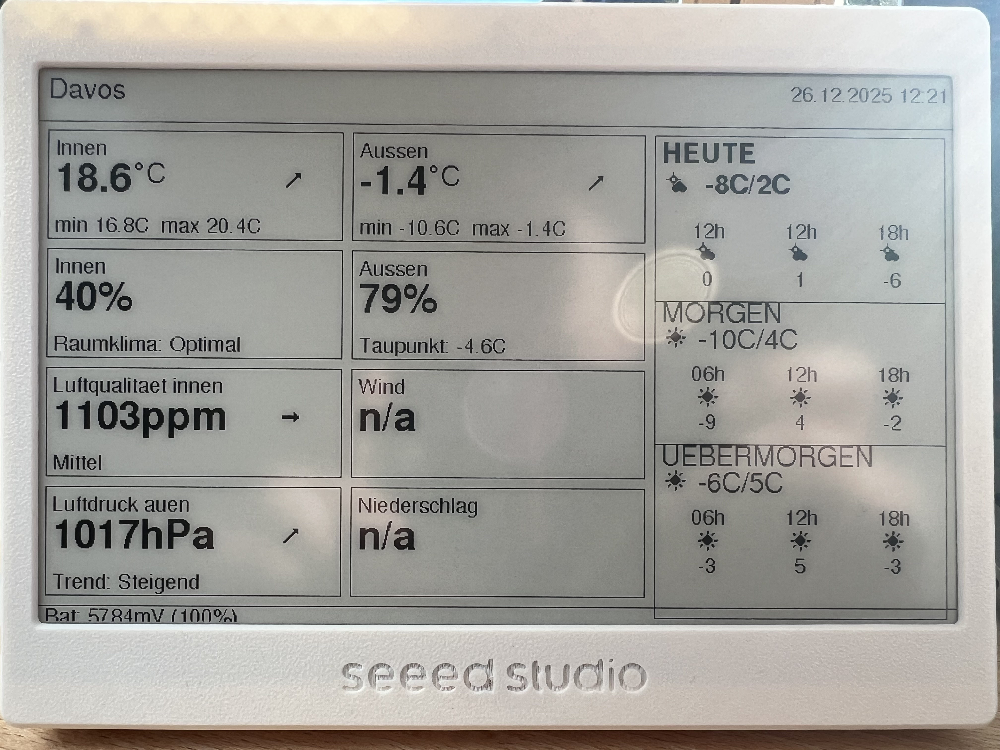

# ESP32 Weather Dashboard

A weather dashboard for XIAO ESP32-C3 with 7.5" ePaper display that shows indoor/outdoor climate data from Netatmo and weather forecasts from MeteoSwiss (Open-Meteo).



## Features

- **Netatmo Integration**: Indoor temperature, humidity, CO2, pressure with trends
- **Outdoor Monitoring**: Temperature, humidity, min/max values
- **Weather Forecast**: 3-day forecast from met.no (yr.no) API with fixed time slots (06h, 12h, 18h)
- **Gemini AI Widget**: Context-aware weather commentary with dry humor and conditional hints
- **Smart CO2 Trends**: Calculated from cached measurements (10 ppm threshold)
- **Power Efficient**: Deep sleep between updates, 1+ week battery life
- **Smart Scheduling**: Updates 11 minutes after Netatmo's update cycle
- **Offline Capable**: LittleFS cache for operation without WiFi
- **Battery Monitoring**: Real-time battery voltage and percentage

## Hardware Requirements

- **MCU**: Seeed Studio XIAO ESP32-C3
- **Display**: Seeed Studio 7.5" ePaper Display (800x480, monochrome)
- **Battery**: 3.7V LiPo (recommended: 2000-3000mAh)
- **Voltage Divider**: 2x 200kΩ resistors (for battery monitoring)

## Software Requirements

- **PlatformIO**: For building and uploading firmware
- **Arduino Framework**: ESP32 Arduino Core

## Project Structure

```
esp32Netatmo/
├── platformio.ini              # Build configuration
├── src/
│   ├── main.cpp                # Main program
│   ├── config.h                # Default configuration
│   ├── config.local.h          # User credentials (gitignored)
│   ├── api/                    # API clients
│   │   ├── netatmo_client.cpp
│   │   ├── meteo_client.cpp
│   │   ├── gemini_client.cpp
│   │   └── http_utils.h
│   ├── display/                # Display widgets
│   │   ├── widgets.cpp
│   │   ├── layout.h
│   │   └── fonts.h
│   ├── data/                   # Data structures & cache
│   │   ├── weather_data.h
│   │   └── cache.cpp
│   └── power/                  # Power management
│       ├── sleep_manager.cpp
│       └── battery.cpp
└── include/
    └── driver.h                # Display driver config
```

## Setup Instructions

### 1. Install PlatformIO

If you haven't already:
```bash
# Using VSCode
# Install PlatformIO IDE extension

# Or using CLI
pip install platformio
```

### 2. Clone and Configure

```bash
cd /Users/tobiastschopp/Sites/esp32Netatmo
```

The `config.local.h` file has already been created with your credentials:
- WiFi SSID: `2p4Dischma19`
- WiFi Password: (configured)
- Netatmo Client ID, Secret, and Refresh Token: (configured)
- Default Station: Davos (Grialetschhüsli)

### 3. Build and Upload

```bash
# Build the project
pio run

# Upload to ESP32
pio run --target upload

# Monitor serial output
pio device monitor
```

## Configuration

### WiFi Settings
Edit `src/config.local.h`:
```cpp
#define WIFI_SSID "YourNetworkName"
#define WIFI_PASSWORD "YourPassword"
```

### Netatmo API
Already configured with your credentials. If you need to change:
```cpp
#define NETATMO_CLIENT_ID "your_client_id"
#define NETATMO_CLIENT_SECRET "your_secret"
#define NETATMO_REFRESH_TOKEN "your_refresh_token"
```

### Gemini AI API
Get a free API key from [Google AI Studio](https://aistudio.google.com/apikey):
```cpp
#define GEMINI_API_KEY "your-api-key-here"
```

**Free Tier Limits**:
- 15 requests per minute
- 1,500 requests per day
- Our usage: ~130 requests/day (well within limits)

### Station Selection
To change from Davos to another station:
```cpp
// Luzern
#define NETATMO_DEVICE_ID "70:ee:50:15:fc:4e"
#define LOCATION_LAT 47.0647
#define LOCATION_LON 8.3069
#define LOCATION_NAME "Luzern"

// Waltenschwil
#define NETATMO_DEVICE_ID "70:ee:50:36:cd:82"
#define LOCATION_LAT 47.3923
#define LOCATION_LON 8.2917
#define LOCATION_NAME "Waltenschwil"
```

### Update Interval
Default is 11 minutes after Netatmo update. To change:
```cpp
#define UPDATE_INTERVAL_MIN 11  // minutes
```

## Display Layout

```
┌─────────────────────────────────────────────────────────────┐
│ Davos                           26.12.2025 14:30            │
├──────────────┬──────────────┬────────────────────────────────┤
│ INDOOR       │ OUTDOOR      │ ┌─────────────────────────┐   │
│ Temp  23.5°C ↑│ Temp  12.3°C ↓│ │ Heute                   │   │
│ Humid 45%    │ Humid 65%    │ │ [☀] -9/1°C              │   │
│ CO2   850ppm ↓│              │ │ [icons] [temp] [precip] │   │
│ Press 1015   │ AI WIDGET:   │ └─────────────────────────┘   │
│              │ "Draussen    │ ┌─────────────────────────┐   │
│              │ kalt, drinnen│ │ Morgen                  │   │
│              │ gemuetlich!" │ │ [☁] -10/4°C             │   │
│              │              │ │ [icons] [temp] [precip] │   │
│              │              │ └─────────────────────────┘   │
│              │              │ ┌─────────────────────────┐   │
│              │              │ │ Uebermorgen             │   │
│              │              │ │ [⛅] -6/5°C              │   │
│              │              │ │ [icons] [temp] [precip] │   │
│              │              │ └─────────────────────────┘   │
└──────────────┴──────────────┴────────────────────────────────┘
```

**3-Column Layout**:
- **Column 1 (Indoor)**: Temperature, Humidity, CO2 (calculated trend), Pressure
- **Column 2 (Outdoor + AI)**: Temperature, Humidity, Gemini AI commentary
- **Column 3 (Forecast)**: 3 individual cards (Heute, Morgen, Uebermorgen)

**Forecast Widget Features** (updated 2025-12-26):
- Individual section borders with 8px gaps (matching column spacing)
- Fixed time slots: 06h, 12h, 18h (shown even if in the past)
- Historical placeholders: Shows "-" for past times without data
- Compact layout: Removed time labels to save space
- Always shows precipitation with "mm" unit
- Custom degree symbols (°C) matching other widgets
- Equal heights: 128px, 127px, 127px for optimal space utilization

## Power Management

### Deep Sleep Strategy
- Updates every 11 minutes after Netatmo's data refresh
- WiFi only enabled during updates
- Display powered off between updates
- Expected battery life: 1-2 weeks (2000mAh battery)

### Battery Monitoring
- Real-time voltage and percentage display
- Low battery warnings
- Voltage range: 3.3V (0%) to 4.35V (100%)

## Font System

### FreeFonts Limitations

The dashboard uses FreeFonts from Seeed_GFX which only support ASCII characters (0x20-0x7E). This means:
- **No German umlauts**: ä, ö, ü displayed as "ae", "oe", "ue"
- **No degree symbol**: Custom-drawn using circles instead

### Custom Degree Symbol

Temperature displays use a custom rendering approach that:
1. Renders the numeric value (e.g., "18.3")
2. Draws the degree symbol as two concentric circles (radius 2 and 3)
3. Adds "C" after the symbol with 4px spacing before the degree symbol
4. Result: "18.3 °C" with proper readability

**Used in**:
- Indoor/Outdoor current temperatures (`drawTemperature()` helper)
- Indoor/Outdoor min/max temperatures (inline rendering)
- 3-day forecast temperatures (all 3 time slots per day)

**Note**: We attempted migration to U8g2 fonts for UTF-8 support but encountered rendering issues with 1-bit sprite buffers. FreeFonts remain the stable solution.

### Combined Units

All units are displayed directly after values with no spacing:
- Temperature: `18.3 °C` (degree symbol custom-drawn)
- Humidity: `65%`
- CO2: `850ppm`
- Pressure: `1015hPa`
- Wind: `12km/h`
- Rain: `2.5mm/24h`

## Troubleshooting

### Display Issues

**Problem**: Display shows corrupted data or freezes

**Solution**: The Seeed_GFX library requires `display.begin()` before each `update()`. This is already implemented in the code.

**Problem**: Display update takes very long (>30 seconds)

**Solution**: Normal ePaper refresh takes 15-20 seconds. Watchdog is disabled automatically.

**Problem**: Text doesn't render or appears garbled

**Solution**: Ensure FreeFonts are being used. U8g2 fonts are incompatible with the 1-bit sprite buffer used by the ePaper display.

### WiFi Issues

**Problem**: Cannot connect to WiFi

**Solutions**:
1. Check SSID and password in `config.local.h`
2. Ensure WiFi is 2.4GHz (ESP32-C3 doesn't support 5GHz)
3. Check signal strength (RSSI logged in serial output)

### API Issues

**Problem**: Netatmo API returns errors

**Solutions**:
1. Verify credentials in `config.local.h`
2. Check if refresh token is still valid
3. Monitor serial output for detailed error messages
4. Cached data will be used if API fails

**Problem**: No forecast data

**Solution**: MeteoSwiss API (Open-Meteo) is free and doesn't require authentication. Check coordinates are correct for your location.

### Memory Issues

**Problem**: ESP32 reboots or crashes

**Solutions**:
1. Check free heap in serial output
2. ESP32-C3 has limited RAM (400KB)
3. Reduce JSON buffer sizes if needed

## Serial Debugging

Connect to serial monitor:
```bash
pio device monitor -b 115200
```

Look for these key log messages:
- `[wifi]` - WiFi connection status
- `[netatmo]` - API calls and data parsing
- `[meteo]` - Forecast API calls
- `[cache]` - Cache operations
- `[display]` - Display updates
- `[sleep]` - Sleep/wake cycles
- `[battery]` - Battery readings

## Performance Metrics

| Metric | Target | Typical |
|--------|--------|---------|
| Boot to Display | < 30s | 20-25s |
| WiFi Connect | < 10s | 3-5s |
| API Calls (total) | < 15s | 8-12s |
| Display Update | 15-20s | 16-18s |
| Deep Sleep Current | < 100µA | 50-80µA |
| Battery Life (2000mAh) | > 1 week | 10-14 days |

## API Documentation

### Netatmo API
- **Base URL**: `https://api.netatmo.com`
- **Authentication**: OAuth2 refresh token flow
- **Endpoint**: `/api/getstationsdata`
- **Rate Limit**: 50 requests per 10 seconds
- **Data Update**: Every 10 minutes

### met.no (yr.no) API
- **Base URL**: `https://api.met.no/weatherapi/locationforecast/2.0/compact`
- **Authentication**: None (requires User-Agent header)
- **Parameters**: Latitude, Longitude
- **Update**: Hourly forecasts
- **Coverage**: Worldwide

### Gemini AI API
- **Model**: `gemini-2.0-flash-exp`
- **Base URL**: `https://generativelanguage.googleapis.com/v1beta`
- **Authentication**: API key in `x-goog-api-key` header
- **Rate Limit**: 15 req/min, 1500 req/day (free tier)
- **Response**: Context-aware German weather commentary (max 160 chars)
- **Contextual Intelligence** (updated 2025-12-26):
  - Conditional hints: Only mentions ventilation when CO2 > 1500 ppm
  - Temperature hints: Only mentions heating when temp < 20°C
  - Randomization: 50% chance for each hint to prevent repetition
  - Easter egg: 2% chance for cat mode ("Miau Miau")
  - Timestamp: Formatted as dd.mm.yyyy hh:mm for time-based deductions

## License

This project is for personal use. Netatmo and Open-Meteo APIs are subject to their respective terms of service.

## Credits

- **Reference Projects**:
  - Seeed_GFX library for ePaper display
  - M5Paper_Remote_Dashboard_Seed for XIAO ePaper patterns
  - netatmo-dashboard for API integration patterns

## Support

For issues or questions:
1. Check serial output for detailed error messages
2. Review this README's troubleshooting section
3. Check configuration in `config.local.h`
4. Verify API credentials are correct

## Next Steps

After successful deployment:
1. Monitor battery life over several days
2. Adjust update interval if needed
3. Customize widget layout in `src/display/layout.h`
4. Add additional sensors or data sources

Enjoy your weather dashboard!
