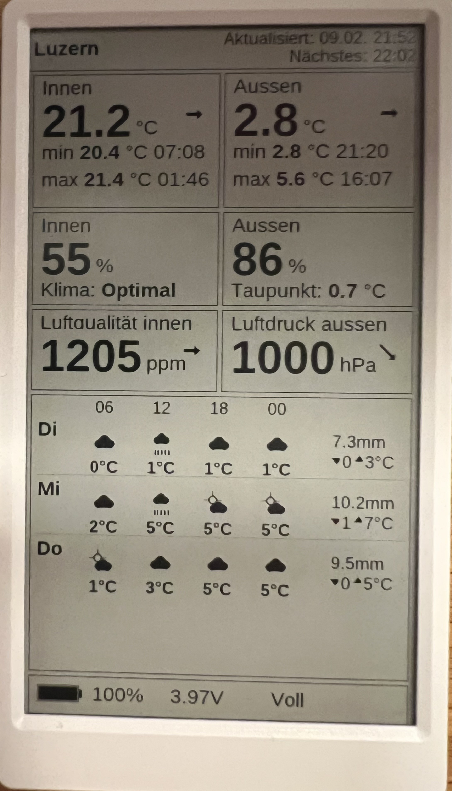

# M5Paper Weather Dashboard

A weather dashboard for M5Paper (ESP32 + 4.7" ePaper) that displays indoor/outdoor climate data from Netatmo and 3-day weather forecasts from met.no.



## Features

- **Netatmo Integration**: Indoor/outdoor temperature, humidity, CO2, pressure with trend arrows
- **Weather Forecast**: 3-day forecast from met.no API with 4 time slots (06h, 12h, 18h, 00h), weather icons, precipitation and min/max temperatures
- **Smart Scheduling**: Wakes 11 minutes after Netatmo's update cycle, uses RTC alarm for reliable wake-up
- **Power Efficient**: Deep sleep between updates, battery monitoring with voltage/percentage display
- **Offline Capable**: LittleFS cache for operation when WiFi is unavailable
- **TTF Fonts**: Liberation Sans (regular + bold) rendered via M5EPD's TTF engine for clean typography

## Hardware

- **M5Paper**: ESP32-D0WDQ6 + 4.7" ePaper (540x960), built-in RTC (BM8563), 8MB PSRAM
- **Battery**: Built-in 1150mAh LiPo (or external 3.7V LiPo)

## Quick Start

### 1. Configure credentials

Copy the template and fill in your credentials:

```bash
cp src/config.h src/config.local.h
```

Edit `src/config.local.h`:

```cpp
#define WIFI_SSID "YourNetwork"
#define WIFI_PASSWORD "YourPassword"

#define NETATMO_CLIENT_ID "your_client_id"
#define NETATMO_CLIENT_SECRET "your_secret"
#define NETATMO_REFRESH_TOKEN "your_refresh_token"

#define NETATMO_DEVICE_ID "70:ee:50:xx:xx:xx"
#define LOCATION_LAT 47.0647
#define LOCATION_LON 8.3069
#define LOCATION_NAME "Luzern"
```

### 2. Build and flash

```bash
pio run                    # Build firmware
pio run --target upload    # Flash to M5Paper
pio device monitor         # Serial console (115200 baud)
```

## Project Structure

```
src/
├── main.cpp                # Orchestration: WiFi, NTP, APIs, display, sleep
├── config.h                # Default configuration
├── config.local.h          # User credentials (gitignored)
├── api/
│   ├── netatmo_client.cpp  # Netatmo OAuth2 + weather data
│   ├── meteo_client.cpp    # met.no forecast API
│   └── http_utils.h        # Shared HTTP/retry logic
├── display/
│   ├── widgets.cpp         # Card rendering (all dashboard widgets)
│   ├── layout.h            # Coordinates and sizing constants
│   ├── icons.cpp           # Weather condition icons
│   └── fonts.h             # TTF font helpers
├── data/
│   ├── weather_data.h      # All data structures
│   └── cache.cpp           # LittleFS JSON persistence
└── power/
    ├── sleep_manager.cpp   # Deep sleep scheduling (RTC alarm + timer)
    └── battery.cpp         # Voltage to percentage mapping
```

## How It Works

```
setup() -> Hardware init -> WiFi -> NTP sync -> Fetch APIs -> Cache to LittleFS -> Render -> Deep sleep
```

The device runs in single-shot mode: `setup()` does everything, `loop()` never executes. After rendering the display, it calculates the next wake time (11 minutes after Netatmo's last update) and enters deep sleep.

**Sleep strategy**: For sleeps < 255 seconds, the BM8563 timer is used at second precision. For longer sleeps, an RTC alarm is set at a specific UTC time (the timer switches to unreliable minute resolution above 255s).

## Display Layout

The 540x960 portrait display shows:

| Widget | Content |
|--------|---------|
| **Header** | Location name, last update time, next wake time |
| **Temperature** | Indoor/outdoor current temp with trend arrows, daily min/max with timestamps |
| **Humidity** | Indoor (with comfort label) / outdoor (with dew point) |
| **Air Quality** | CO2 (ppm) with trend arrow / barometric pressure (hPa) with trend arrow |
| **Forecast** | 3-day forecast: weather icons, temperatures per time slot, precipitation, daily min/max |
| **Battery** | Icon, percentage, voltage, charge state |

## Configuration

Key settings in `src/config.h` (override in `config.local.h`):

| Setting | Default | Description |
|---------|---------|-------------|
| `UPDATE_INTERVAL_SEC` | 660 (11 min) | Wake interval after Netatmo update |
| `MINIMUM_SLEEP_SEC` | 60 | Minimum sleep for stale-data retries |
| `MAXIMUM_SLEEP_SEC` | 900 (15 min) | Maximum sleep duration |
| `FALLBACK_SLEEP_SEC` | 660 (11 min) | Sleep when no Netatmo timestamp |

## Serial Debugging

```bash
pio device monitor -b 115200
```

Log prefixes: `[wifi]` `[netatmo]` `[meteo]` `[cache]` `[display]` `[sleep]` `[battery]`

## APIs

- **Netatmo**: OAuth2 refresh token flow, `/api/getstationsdata`, updates every ~10 min
- **met.no**: Free, no auth (requires User-Agent header), worldwide hourly forecasts

## License

This project is for personal use. Netatmo and met.no APIs are subject to their respective terms of service.
